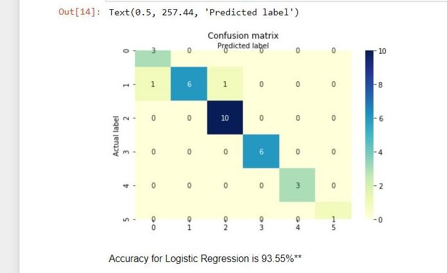
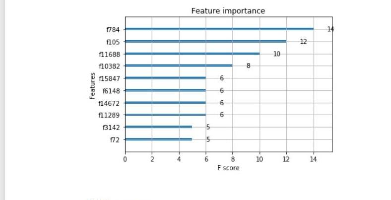
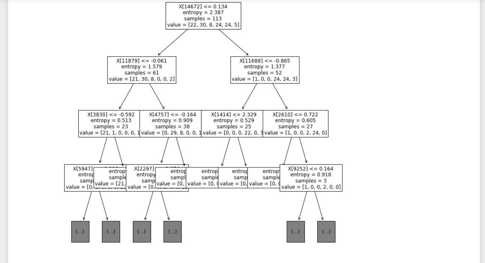

# Breast-Cancer-Cells-Data-Science-Project
# About
For this project, the data I am exploiting is a dataset from the CuMiDa repository
that contains 78 handpicked cancer microarray datasets. In this dataset the main
features are the gene expression levels of 54676 genes in the columns from 151 breast
cancer cell samples in the rows. Furthermore, the five different cancer cells will be
present as well and the target will be the different cancer cells that the amount of genes
are present. The question I want to answer is which cancer cells have the most genes
found in them and which models and neural networks would have the best accuracy for this dataset.

In this dataset I found that there are 41 basal cell types, 30 luminal_B cell types,
30 HER cell types, 29 luminal_A cell types, 14 cell line cell types, and finally 7 normal
cell types

# Documentation
The Data Science techniques I used was Logistic Regression, XGBoost, K Means, and Decision Tree Classification. After implementing each of these techniques I found that 
logistic regression had the highest accuracy, with 93.55%.

# Logistic Regression Confusion Matrix Results

# XGBoost 

# K Means Cluster Errors Results

# Decision Tree Classification Results

